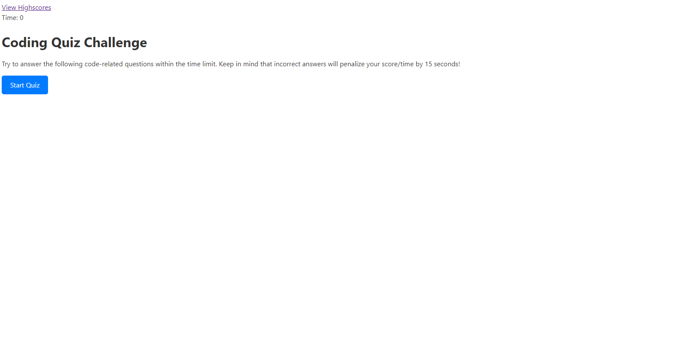

# Challenge 4 Coding Quiz

## Table of Contents
- Decsription
- Solution/Notes
- Credits

## Description

For this challenge created the Javascript to create a short coding quiz that saves the answers on local storage and are displayed in a high score area of the app.

## Solutions/Notes

- I started with creating an html page that included a section for each of the questions. I gave each an id so that they could be selected in my Javascript file.
- I made just a little styling to the buttons as well as making it so that my questions would be hidden until the quiz is started.
- From there I created an object to store all of questions in, and made selectors for each element that I would be leveraging in my app.
- I then created a function to run the new quiz and gave it a timmer that would tick down. I created a function to cycle through each of the questions and choices.
-  I also created a function to check the answers if they were correct or not. If they were incorrect, the user would be penalized and time would go away.
- Lastly I created a function to store the scores on local storage and have them displayed in a high scores section on the page.

## Credits

Github_Repo-"https://kgran12.github.io/challenge-4/"
screenshot - 